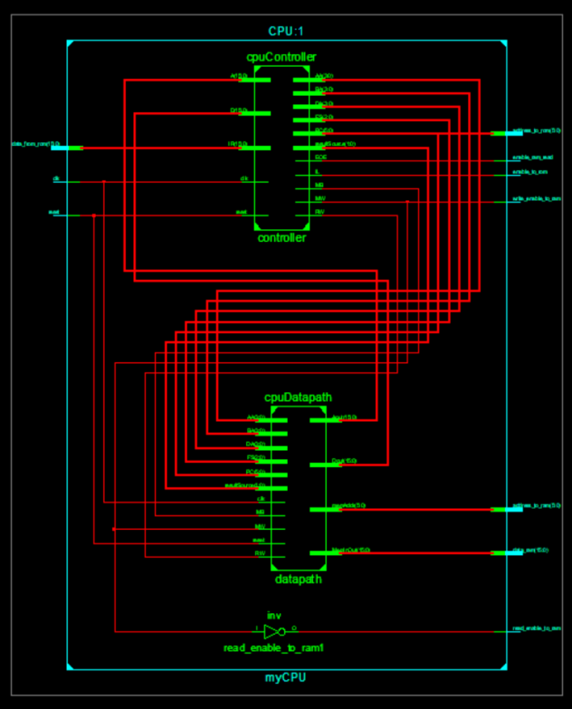

## What is this?
This repository contains the design files of a 16 bit RISC processor designed in Verilog-HDL. The 16 bit RISC processor architecture features 16 bit instruction words, 16 internal general-purpose registers, and 6 external address lines to a ROM and 6 external address lines to an external memory (RAM).

## Features
Features of the processor can be summarized as follows;
* 16-bit RISC microprocessor based on a simplified version of the MIPS architecture
* Every instruction is completed in two cycles
* 16 instructions in the instruction set architecture.
* 16 general purpose registers.
* 6 external address lines to a ROM and 6 external address lines to a RAM
* 16 data lines to a ROM and 16 data lines to a RAM
* One bit execution complete line

## Pin descriptions

## Instruction set architecture

**Arithmetic (Two’s Complement) ALU operations**
* ADD: Rd = Rs + Rt
* SUB: Rd = Rs - Rt

**Logical ALU operation**
* AND: Rd = Rs & Rt
* OR: Rd = Rs | Rt
* XOR: Rd = Rs ^ Rt
* NOT: Rd = ~Rs
* SLA: Rd = Rs << 1
* SRA: Rd = Rs >> 1

**Memory operations**
* LI: Rd = 8-bit Sign extended Immediate
* LW: Rd = Mem[Rs[5:0]]
* SW: Mem[ Rs[5:0] ] = Rt

**Conditional Branch operations**
* BIZ: PC = PC + 1 + Offset if Rs = 0
* BNZ: PC = PC + 1 + Offset if Rs != 0

**Program Count Jump operations**
* JAL: Rd = PC + 1 and PC = PC + 1 + Offset
* JMP: PC = PC + 1 + Offset
* JR: PC = Rs
* EOE: End of execution

## Schematics
The design of the CPU follows standard controller-dapath division.

The controller consists of three components: the control logic, program counter, and instruction register

The datapath consists of two major components: the register file and the functional unit

## Demo
rom_instructions.coe contains a sample program written in hex to be fed to the processor. The program deliberately performs a variety of operations to test the correct operation of all CPU instructions. Upon completion, the program should perform  the following register transfers: (R7,R13,M15 <-- R3*R4; R14,M17 <-- R13-1)

The following screenshot shows a looping section of the program showing: 
* Blue: Left shift 
* Indigo: Right shift 
* Red: Branch if not zero 
* Purple: Return

And another couple screenshot of the final results:

